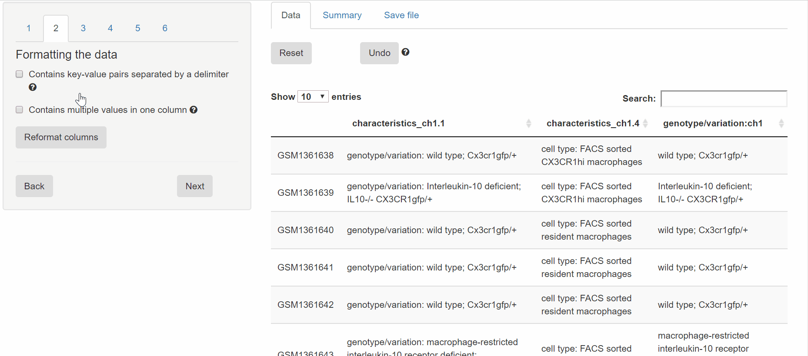

## Separating multiple values in a column

If one or more columns contain multiple values in a single column, like

`genotype/variation: wild type; Cx3cr1gfp/+`

...then these columns might need to be split so that each value is in its own column. These values will be split on a delimiter, which is one or more characters between the separate values. In the above example, the delimiter would be "; ".

Here is an example of the split variables functionality with GSE56444:

